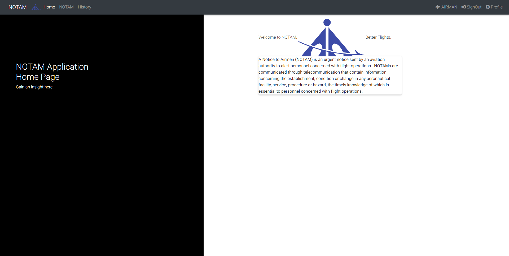

# Notice to Air-Men (NOTAM) 
This was made as collaboration with the Design Innovation Centre (IIT-BHU).

## Problem Statement
A NOTAM is a notice that is originated and disseminated to the users whenever the information to be distributed is of a temporary nature and of short duration or when operationally significant permanent changes, or temporary changes of long duration are made at short notice, except for extensive text and/or graphics. However, at times it may be difficult to visualize the situation through the text only message.

## Introduction
- A Notice to Airmen (NOTAM) is an urgent notice sent by an aviation authority to alert personnel concerned with flight operations. 

- NOTAMs are communicated through telecommunication that contain information concerning the establishment, condition or change in any aeronautical facility, service, procedure or hazard, the timely knowledge of which is essential to personnel concerned with flight operations. 

- NOTAMs contain instructions written in the form of abbreviations using all upper case letters to minimize the size of the notice for the easily transferable to flying aircraft by the telecommunication method even in adversary environment. 

- As a consequence, reduced volume and exceedingly use of abbreviations make NOTAMs difficult to read, write and understand.

- Air Canada Flight 759 nearly crashed into four other airliners in July 2017 as it attempted to land on a San Francisco taxiway misidentified as a runway: the next runway was closed but the information was buried in the NOTAM. U.S. civil transportation accident investigation agency National Transportation Safety Board (NTSB) stated NOTAMs were unintelligible and ignored, and recommended a more effective information presentation for better relevance.

## Our Proposal
We are proposing a web based application that will provide following features:
1. The application will describe instructions written in the NOTAM with accuracy and present them in easily readable form to the personnel concerned with flight operations. 
2. An authorized person will be able to securely login on the application and write the instructions on the NOTAM easily by selecting dropdown menus to describe the scenario. 
3. The application will provide the interface to easily send the NOTAM to the intended individual receiver or group receiver by selecting flight number, flying rout, destination or pilot ID etc. 
4. The application will store history of NOTAMs that will be easily accessible by searching and viewed in specific orders on the basis of many attributes. 
5. The application will be developed on the basis of rules and regulation regarding NOTAM, instructed by Aeronautical Information Services, Department of Airports Authority of India.

## Use Case Diagram

## Screenshots

- ### Home

- ### Home LoggedIn

- ### Airmen Login

- ### NOTAM History

- ### NOTAM Manage

- ### Profile

